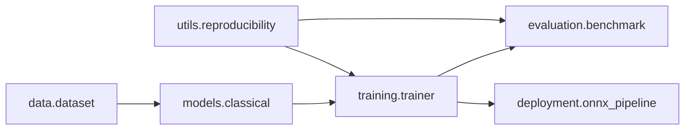

# Hardware-Aware Classification of Handwritten Digits

This repository now provides a modular, reproducible ML system for MNIST classification with a research-focused workflow for **compression**, **quantization**, **deployment**, and **hardware-aware benchmarking**.

## Architecture



## Project Structure

- `Classification of Handwritten Digits/task/ml_system/data/` — dataset loading, preprocessing, validation metadata.
- `Classification of Handwritten Digits/task/ml_system/models/` — baseline models, pruning, quantization transforms.
- `Classification of Handwritten Digits/task/ml_system/training/` — deterministic training and compression/quantization runs.
- `Classification of Handwritten Digits/task/ml_system/evaluation/` — repeated benchmarking, confidence intervals, hardware simulation.
- `Classification of Handwritten Digits/task/ml_system/deployment/` — ONNX export, CPU/batch inference, ONNX validation.
- `Classification of Handwritten Digits/task/ml_system/config.py` — central configuration dataclasses.

## Reproducible Workflow

```bash
python "Classification of Handwritten Digits/task/train_cli.py" --model knn --run-compression --run-quantization
python "Classification of Handwritten Digits/task/evaluate_cli.py" --model knn --runs 5 --memory-budget-mb 8 --compute-scale 0.75
python "Classification of Handwritten Digits/task/evaluate_cli.py" --model knn --runs 3 --memory-budget-mb 4 --compute-scale 0.6 --run-pruning-efficiency --pruning-type weight --sparsity-levels '0.0,0.2,0.4,0.6,0.8'
python "Classification of Handwritten Digits/task/infer_cli.py" --model knn --batch-size 64 --export-onnx
```

## Hardware-aware / Edge Features

- Deterministic seeds and dataset metadata fingerprints.
- Structured compression:
  - weight pruning (magnitude thresholding),
  - neuron pruning (variance-based feature pruning).
- Precision benchmarking (`float32`, `float16`, simulated `int8`).
- ONNX export and ONNX-vs-sklearn output agreement check.
- Batch CPU inference and throughput metrics.
- Hardware simulation with memory budget + compute scale auto-batch adaptation.
- Energy-per-inference estimation from measured latency.


## Focused pruning + hardware efficiency experiment

Use `evaluate_cli.py` with `--run-pruning-efficiency` to benchmark pruning under constrained resources. The experiment reports reproducible per-level aggregates (mean/std/95% CI) for:
- latency,
- throughput,
- memory footprint (`eval_memory_mb` and serialized `model_memory_mb`),
- energy per inference,
- and accuracy.

Generated artifacts:
- `artifacts/pruning_efficiency_<model>_<pruning_type>.json`
- `artifacts/sparsity_vs_accuracy_<model>_<pruning_type>.png`
- `artifacts/sparsity_vs_latency_<model>_<pruning_type>.png`
- `artifacts/sparsity_vs_energy_<model>_<pruning_type>.png`

## Artifacts

Runs save JSON logs and plots to `artifacts/`:
- training, compression, quantization metrics,
- benchmark stats with mean/std/95% CI,
- resource-vs-accuracy and accuracy comparison plots,
- pruning hardware-efficiency logs across sparsity levels (latency/throughput/memory/energy),
- plots: sparsity-vs-accuracy, sparsity-vs-latency, sparsity-vs-energy,
- ONNX deployment report.

## Backward compatibility

`Classification of Handwritten Digits/task/analysis.py` remains as a compatibility entrypoint and still prints KNN and Random Forest accuracy outputs.
