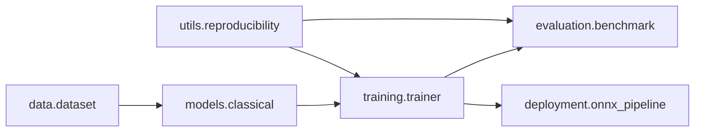

# Hardware-Aware Classification of Handwritten Digits

This repository provides a modular, reproducible ML system for MNIST/digits classification with a research-focused workflow for **model-level compression**, **quantization**, **deployment**, and **hardware-aware benchmarking**.

## Architecture



## Project Structure

- `Classification of Handwritten Digits/task/ml_system/data/` — dataset loading, preprocessing, strict dataset mode, checksum/version metadata.
- `Classification of Handwritten Digits/task/ml_system/models/` — baseline models, feature masking methods, model-level pruning/compression.
- `Classification of Handwritten Digits/task/ml_system/training/` — deterministic training and compression/quantization runs.
- `Classification of Handwritten Digits/task/ml_system/evaluation/` — repeated benchmarking, confidence intervals, hardware simulation.
- `Classification of Handwritten Digits/task/ml_system/deployment/` — ONNX export, CPU/batch inference, ONNX parity validation.
- `Classification of Handwritten Digits/task/ml_system/config.py` — central configuration dataclasses.

## Reproducible Workflow

```bash
python "Classification of Handwritten Digits/task/train_cli.py" --model knn --dataset digits --run-compression --run-quantization
python "Classification of Handwritten Digits/task/evaluate_cli.py" --model knn --dataset digits --runs 5 --memory-budget-mb 8 --compute-scale 0.75
python "Classification of Handwritten Digits/task/evaluate_cli.py" --model rf --dataset digits --runs 3 --run-model-compression --compression-levels '0.0,0.2,0.4,0.6'
python "Classification of Handwritten Digits/task/infer_cli.py" --model knn --dataset digits --batch-size 64 --export-onnx --onnx-min-agreement 0.98
```

## Compression methods (clarified)

Two families are implemented:

1. **Feature-masking compression** (data-space transformations):
   - weight masking (magnitude thresholding),
   - neuron masking (variance-based feature dropping).
2. **True model-level compression**:
   - KNN prototype reduction (removes redundant training samples via nearest-neighbor redundancy score),
   - RandomForest pruning via depth constraint + cost-complexity pruning (`ccp_alpha`) + larger `min_samples_leaf` (leaf merging pressure).

Model-level compression experiments report mean/std/95% CI for:
- accuracy,
- inference latency,
- serialized model size,
- compression ratio.

Artifacts:
- `artifacts/model_level_compression_<model>.json`
- `artifacts/compression_ratio_vs_accuracy_<model>.png`
- `artifacts/compression_ratio_vs_latency_<model>.png`

## Hardware-aware / Edge Features

- Deterministic seeds and dataset metadata fingerprints (dataset name + version + checksum).
- Precision benchmarking (`float32`, `float16`, simulated `int8`).
- ONNX export and ONNX-vs-native parity validation with configurable threshold.
- Batch CPU inference and throughput metrics.
- Hardware simulation with memory budget + compute scale auto-batch adaptation.
- Energy-per-inference estimation from measured latency.

## Dataset integrity

Dataset mode is explicit and reproducible:
- `--dataset mnist` (Keras MNIST download),
- `--dataset digits` (sklearn offline digits).

No silent fallback is used. If dataset loading fails, the run fails loudly; with `--fail-fast-dataset`, the exception path is strict.

## Artifacts

Runs save JSON logs and plots to `artifacts/`:
- training, feature-masking compression, quantization metrics,
- model-level compression stats and plots,
- benchmark stats with mean/std/95% CI,
- resource-vs-accuracy and accuracy comparison plots,
- pruning hardware-efficiency logs across sparsity levels (latency/throughput/memory/energy),
- ONNX deployment report with parity threshold result.

## Backward compatibility

`Classification of Handwritten Digits/task/analysis.py` remains a compatibility entrypoint and still prints KNN and Random Forest accuracy outputs.
